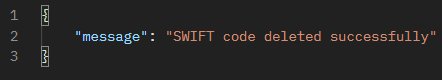

# SWIFT_Codes application

## How build and run:
#### Build a .jar:
```bash
mvn clean package
```
###
#### Run with Docker:
```bash
docker compose up --build
```
### Load data from CSV:
```bash
curl --form file='@csv.csv'  http://localhost:8080/v1/swift-codes/import-csv
```
## Available API Endpoints:
### Base URL:
http://localhost:8080/v1/swift-codes/...

| Method | Endpoint                                | Description                 |
|--------|-----------------------------------------|-----------------------------|
| `GET`  | `/v1/swift-codes/{swiftCode}`           | Get all SWIFT codes         |
| `GET`  | `/v1/swift-codes/country/{countryCode}` | Get SWIFT codes by country  |
|`DELETE`| `/v1/swift-codes/{swiftCode}`           | Deletes a SWIFT code        | 
| `POST` | `/v1/swift-codes/import-csv`            | Import SWIFT codes from CSV |
| `POST` | `/v1/swift-codes/`                      | Adds new SWIFT code         |

## Example:
#### Endpoint `GET`: http://localhost:8080/v1/swift-codes/country/UY
#### Output:

#### Endpoint `GET`: http://localhost:8080/v1/swift-codes/ALBPPLPWXXX
#### Output:

#### Endpoint `POST`: http://localhost:8080/v1/swift-codes/ 
#### **Request Body for `POST /vi/swift-codes/`**
```json
{
  "address": "KRAKÓW, GRZEGÓRZKI",
  "bankName": "BANK XYZ",
  "countryISO2": "PL",
  "countryName": "POLAND",
  "isHeadquarter": false,
  "swiftCode": "ABCDEFGH123"
}
```
#### Output:

###### SWIFT code is now in a database.

#### Endpoint `DELETE`: http://localhost:8080/v1/swift-codes/ABCDEFGH123
#### Output:

###### SWIFT code is deleted.